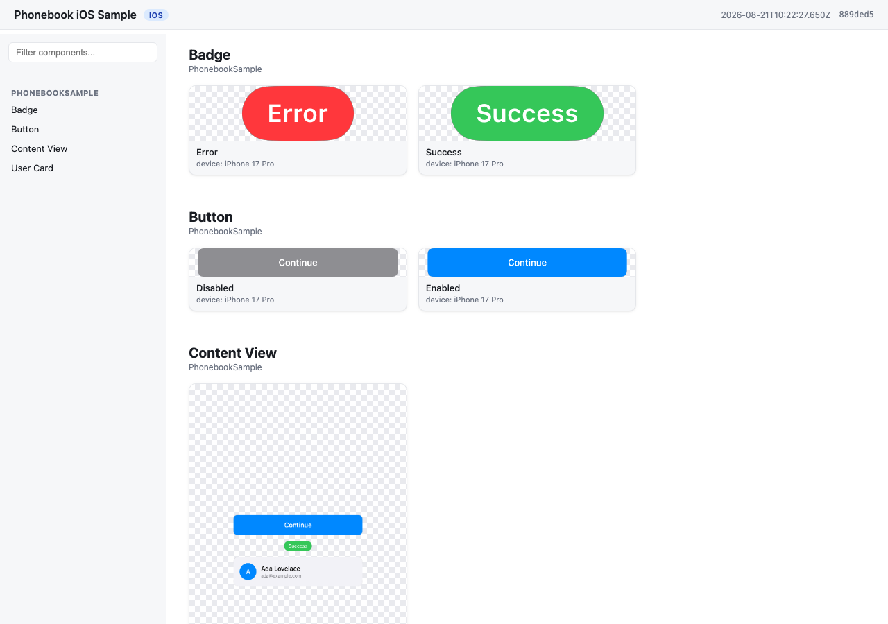

<div align="center">

# @stag/phonebook

<p>A self-hosted, open-source alternative to Emerge Tools Snapshots: harvest your existing Compose <code>@Preview</code>s and SwiftUI <code>#Preview</code>s into a browsable, static HTML gallery — no SaaS account required.</p>


</div>

Phonebook turns screenshots your team already has into a Storybook-style component gallery. No new test code, no design tokens to maintain by hand — it renders what's already in your codebase into a static site designers can open without installing anything. Each repo runs Phonebook independently; v1 is single-platform, so one Android repo (or one iOS repo) produces one bundle and one site.

## Features

- **Zero new test code** — reuses `@Preview` / `#Preview` you've already written
- **No SaaS account** — self-hosted, runs entirely in your CI or locally
- **MCP-first** — a coding agent can check setup, analyze coverage, add missing previews, and build the gallery for you
- **Smart component grouping** — `component / state` cards inferred from preview names, no required annotation
- **Cross-platform** — Android (Roborazzi + ComposablePreviewScanner, runs on the JVM, no emulator) and iOS (SnapshotPreviews, runs on a simulator)
- **Version-aware setup** — `init`/`doctor` resolve library versions against your project's Kotlin version and catch Kotlin/Roborazzi metadata mismatches before they cause opaque compiler crashes

## Demo



*(replace with an actual screenshot of a generated gallery)*

## How it works

1. `phonebook generate` runs your platform's preview-rendering engine and harvests the output into a **bundle** (`manifest.json` + `images/`).
   - Android: [Roborazzi](https://github.com/takahirom/roborazzi) + [ComposablePreviewScanner](https://github.com/sergio-sastre/ComposablePreviewScanner), run on the JVM via Robolectric. No emulator, works on Linux CI.
   - iOS: [SnapshotPreviews](https://github.com/getsentry/SnapshotPreviews), run via `xcodebuild test` on a simulator. Requires macOS.
2. `phonebook build` turns that bundle into a static site — by default it writes `index.html` directly into the bundle directory (reusing the images already there, no copying), so the site lands at `<bundle>/index.html`. Pass `-o <dir>` to instead copy everything into a standalone site directory (for publishing elsewhere, or later merging multiple bundles). Plain HTML/CSS/JS, works from `file://` or any static host.

Commands run via `npx tsx src/cli.ts <cmd>` for now (npm packaging as `@stag/phonebook` is pending — this repo is not yet on npm).

## Using it with a coding agent (recommended)

Most people won't run the CLI directly — Phonebook is built to be driven by a coding agent (Claude Code, Codex, etc.) through its MCP server. The agent adds previews, runs setup checks, and generates the gallery for you; the CLI underneath is the engine it calls.

The server runs via `npx tsx /path/to/phonebook/src/cli.ts mcp` — no separate install step (npm packaging is pending, see above). Pick your client below.

<details>
<summary><strong>Claude Code</strong></summary>

```sh
claude mcp add phonebook -- npx tsx /path/to/phonebook/src/cli.ts mcp
```

</details>

<details>
<summary><strong>Codex CLI</strong></summary>

Add to `~/.codex/config.toml`:

```toml
[mcp_servers.phonebook]
command = "npx"
args = ["tsx", "/path/to/phonebook/src/cli.ts", "mcp"]
```

</details>

<details>
<summary><strong>Claude Desktop</strong></summary>

Add to your Claude Desktop config (`~/Library/Application Support/Claude/claude_desktop_config.json` on macOS):

```json
{
  "mcpServers": {
    "phonebook": {
      "command": "npx",
      "args": ["tsx", "/path/to/phonebook/src/cli.ts", "mcp"]
    }
  }
}
```

</details>

<details>
<summary><strong>Cursor</strong></summary>

Add to `.cursor/mcp.json` (project) or `~/.cursor/mcp.json` (global):

```json
{
  "mcpServers": {
    "phonebook": {
      "command": "npx",
      "args": ["tsx", "/path/to/phonebook/src/cli.ts", "mcp"]
    }
  }
}
```

</details>

<details>
<summary><strong>Xcode (Codex Agent)</strong> — Xcode 26.3+</summary>

Add to `.codex/config.toml` at your project's workspace root. Xcode's agent runs with a minimal `PATH`, so the command wraps `npx` in a shell that adds the usual Homebrew/nvm locations first:

```toml
[mcp_servers.phonebook]
command = "/bin/zsh"
args = [
  "-lc",
  "PATH=/opt/homebrew/bin:/usr/local/bin:/usr/bin:/bin:/usr/sbin:/sbin; npx tsx /path/to/phonebook/src/cli.ts mcp"
]
enabled = true
```

</details>

<details>
<summary><strong>Xcode (Claude Code Agent)</strong> — Xcode 26.3+</summary>

Add the `mcpServers` block to `~/Library/Developer/Xcode/CodingAssistant/ClaudeAgentConfig/.claude.json`:

```json
{
  "mcpServers": {
    "phonebook": {
      "command": "/bin/zsh",
      "args": [
        "-lc",
        "PATH=/opt/homebrew/bin:/usr/local/bin:/usr/bin:/bin:/usr/sbin:/sbin; npx tsx /path/to/phonebook/src/cli.ts mcp"
      ]
    }
  }
}
```

</details>

**Android Studio (Gemini Agent Mode):** not supported yet — its MCP integration only connects to remote `httpUrl` servers, not local stdio processes like Phonebook's. Use one of the terminal-based clients above (Claude Code, Codex CLI) from the Android repo instead.

In every case, replace `/path/to/phonebook` with the absolute path to this repo. Then, from a chat in your Android or iOS repo, just ask:

> "Use the phonebook MCP and create a catalog for my designer."

The agent figures out the rest — checking setup, filling in missing previews, generating, and building the site. For more targeted asks, it also exposes: `check_setup` (setup diagnosis, same as `phonebook doctor`), `analyze_coverage` (components missing previews or dark variants), `get_preview_guidance`, `run_generate`, and `run_build`.

## Quickstart: Android

Run `phonebook init` first — it detects your project's Kotlin version and prints these instructions with **library versions resolved to be compatible with it** (e.g. Kotlin 2.0 projects get Roborazzi 1.60.0; Kotlin 2.2+ gets the latest). The versions below are what a current-Kotlin project gets (see `samples/android/app/build.gradle.kts` for a full working example):

```kotlin
// app/build.gradle.kts
plugins {
    id("io.github.takahirom.roborazzi") // root build.gradle.kts: version "1.72.0" apply false
}

roborazzi {
    generateComposePreviewRobolectricTests {
        enable = true
        packages = listOf("dev.stag.phonebook.sample") // your app's package
    }
}

dependencies {
    testImplementation("org.robolectric:robolectric:4.14.1")
    testImplementation("io.github.takahirom.roborazzi:roborazzi:1.72.0")
    testImplementation("io.github.takahirom.roborazzi:roborazzi-compose:1.72.0")
    testImplementation("io.github.sergio-sastre.ComposablePreviewScanner:android:0.9.3")
    testImplementation("io.github.takahirom.roborazzi:roborazzi-compose-preview-scanner-support:1.72.0")
    testImplementation("androidx.compose.ui:ui-test-junit4") // version from your Compose BOM, or pin one
}
```

Add a `phonebook.config.json` next to `settings.gradle.kts`:

```json
{
  "appName": "My Android App",
  "platform": "android",
  "android": { "modules": [":app"], "variant": "debug" }
}
```

Then, from the repo containing Phonebook:

```sh
npx tsx src/cli.ts generate -C /path/to/your/android/repo
npx tsx src/cli.ts build -C /path/to/your/android/repo
```

Open `phonebook-out/index.html`.

## Quickstart: iOS

Add the [SnapshotPreviews](https://github.com/getsentry/SnapshotPreviews) SPM package to your project and a small XCTest target that subclasses `SnapshotTest` (see `samples/ios` for a full working example):

```swift
// PhonebookSnapshotTests.swift
import SnapshottingTests

final class PhonebookSnapshotTests: SnapshotTest {
    override class func snapshotPreviews() -> [String]? {
        return nil // record every #Preview
    }
}
```

Add `phonebook.config.json` next to your `.xcodeproj`:

```json
{
  "appName": "My iOS App",
  "platform": "ios",
  "ios": {
    "project": "MyApp.xcodeproj",
    "scheme": "MyApp",
    "simulator": "iPhone 17 Pro"
  }
}
```

Your scheme must build and test the snapshot test target (see `PhonebookSample.xcscheme` in the sample). Then:

```sh
npx tsx src/cli.ts generate -C /path/to/your/ios/repo
npx tsx src/cli.ts build -C /path/to/your/ios/repo
```

Open `phonebook-out/index.html`.

## Naming convention

Phonebook groups screenshots into `component / state` cards from your existing preview names — no required annotation. See [docs/naming-convention.md](docs/naming-convention.md) for the full rules and examples.

## Configuration

`phonebook.config.json`:

| Key | Type | Default | Notes |
| --- | --- | --- | --- |
| `appName` | string | — | Required. Shown in the gallery header. |
| `platform` | `"android"` \| `"ios"` | — | Required. |
| `output` | string | `"phonebook-out"` | Bundle output directory, relative to the config file. |
| `android.modules` | string[] | `[":app"]` | Gradle modules to record. |
| `android.variant` | string | `"debug"` | Build variant; Phonebook runs `<module>:recordRoborazzi<Variant>`. |
| `ios.project` | string | — | Path to `.xcodeproj`, relative to the config file. One of `project`/`workspace` required. |
| `ios.workspace` | string | — | Path to `.xcworkspace`, relative to the config file. |
| `ios.scheme` | string | — | Required. Scheme that includes the SnapshotPreviews test target. |
| `ios.simulator` | string | `"iPhone 17 Pro"` | Simulator device name used for `-destination`. |
| `ios.onlyTesting` | string | auto-detected | `-only-testing:` filter so `generate` runs just the snapshot class, not the app's whole test suite. Auto-derived from the `SnapshotTest` subclass; set `""` to run everything. |

Both `generate` and `build` accept `-C <dir>` (project directory containing `phonebook.config.json`). `generate` takes `-o <dir>` to override the bundle output and `--allow-empty` to tolerate a run that records no previews. `build` takes an optional bundle path — with none, it uses the project's bundle directory — and `-o <dir>` for the site output; without `-o`, `build` writes `index.html` straight into the bundle directory and reuses its `images/` in place (no copying), which is what the quickstarts above do. Pass `-o <dir>` to instead copy the bundle's images into a separate, standalone site directory.

## `phonebook init` and `phonebook doctor`

`phonebook init` detects your platform and scaffolds `phonebook.config.json` plus the dependency/setup snippets — with library versions resolved against your project's Kotlin version and your app package filled in. It never edits your build files for you.

`phonebook doctor` checks that everything `generate` needs is wired up: plugin and test dependencies (resolved through Gradle version catalogs when you use them), the scanner's `packages` value, Kotlin/Roborazzi compatibility, and the toolchain (JDK/Xcode/simulator). Add `--deep` to also compile the test sources — slower, but authoritative when a static check and reality disagree. On iOS, if SnapshotPreviews is linked but no `SnapshotTest` subclass exists yet, `doctor` names the exact target and folder to add it to (parsed from the `.pbxproj`), so you're never just told to "add the class" with no location.

`phonebook init --write-snapshot-class` is the one exception to init's hands-off rule: when doctor's iOS check identifies the linking target *and* that target's source folder is one of Xcode's filesystem-synchronized groups, it writes `<folder>/PhonebookSnapshots.swift` directly — safe because a synchronized folder is picked up by Xcode automatically, so no `project.pbxproj` edit is made. It refuses (with the reason) in every other case: no SnapshotPreviews wiring yet, a non-synchronized-group project, or a subclass that already exists.

`phonebook mcp` runs the MCP server — see "Using it with a coding agent" above for setup and example prompts.

## Requirements

**Android**: JDK 17+. No emulator needed — Roborazzi renders on the JVM via Robolectric, so `generate` runs on Linux CI.

**iOS**: macOS with Xcode installed, plus a booted or bootable simulator (`generate` runs `xcodebuild test` against a named simulator destination). Requires a macOS runner in CI.

See [docs/ci.md](docs/ci.md) for CI recipes and [docs/naming-convention.md](docs/naming-convention.md) for the naming rules.

## Roadmap

Post-v1 (M5), not yet built:

- [ ] Search and filters in the generated gallery
- [ ] Multi-bundle merge with a side-by-side view (cross-platform sites)
- [ ] Version diffing between two runs (the manifest already carries commit + image hashes to enable this)
- [ ] Additional CI recipe docs

## License

MIT — see [LICENSE](LICENSE).
